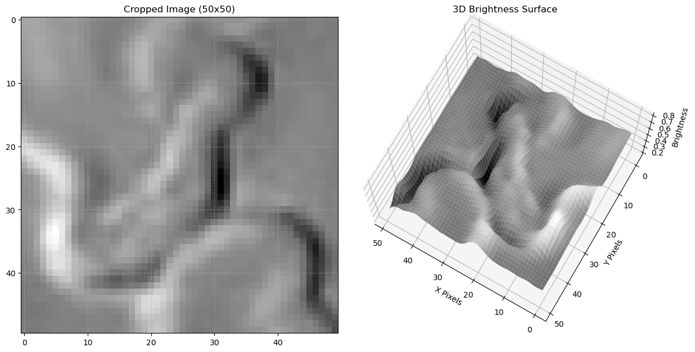
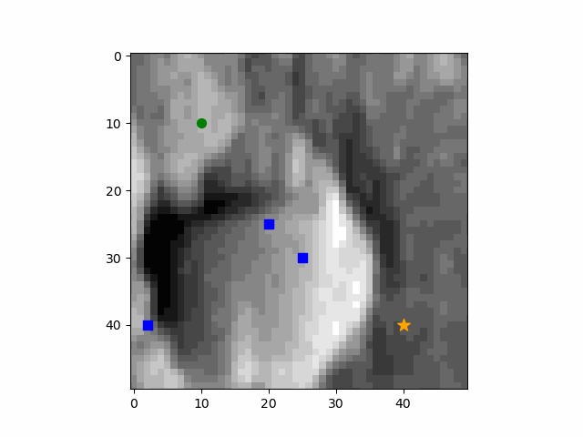

# 🛰️ RL-Guided Planetary Navigation using Synthetic Terrain Generation

This repository contains the code and resources for a research project exploring reinforcement learning (RL)-based autonomous navigation across planetary surfaces. We enhance learning by augmenting terrain data using generative models such as GANs, WGANs, and Diffusion Models — all enforced with scientific constraints to improve generalization and realism.

  

<i>Example of generated planetary terrain</i>

---

## 🎥 Demo

  

<i>RL agent navigating synthetic terrain</i>

---

## 🧠 Key Contributions

- **Reinforcement Learning Agent** using Deep Q-Network (QNet) trained on real and synthetic terrain.
- **Terrain Generation** using:
  - **WGAN** – Enhanced stability with gradient penalty.
  - **Diffusion Model** – Most realistic outputs, guided by an **Enforcer Network**.
- **Enforcer Network** – Applies soft scientific plausibility constraints during generator training.
- **Transfer Learning** – From synthetic terrains to real Moon and Mars orbiter datasets.

---

## 📁 Project Structure

